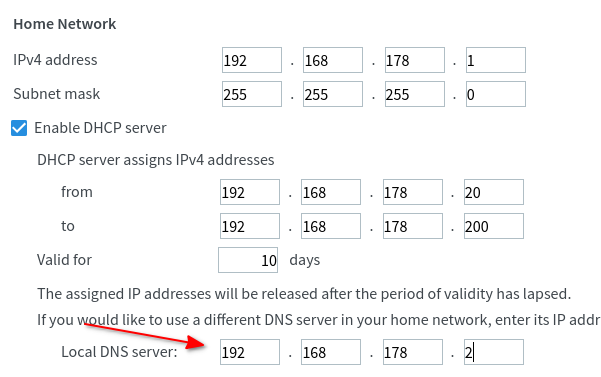

# Network configuration

In order, to benefit from all the advantages of Blockasaurus like ad-blocking, privacy and speed, it is necessary to use
Blockasaurus as DNS server for your devices. You can configure DNS server on each device manually or use DHCP in your network
router and push the right settings to your device. With this approach, you will configure Blockasaurus only once in your
router and each device in your network will automatically use Blockasaurus as DNS server.

## Transparent configuration with DHCP

Let us assume, Blockasaurus is installed on a Raspberry PI with fix IP address `192.168.178.2`. Each device which connects to
the router will obtain an IP address and receive the network configuration. The IP address of the Raspberry PI should be
pushed to the device as DNS server.

```
┌──────────────┐         ┌─────────────────┐
│              │         │ Raspberry PI    │
│  Router      │         │   blockasaurus  │        
│              │         │ 192.168.178.2   │            
└─▲─────┬──────┘         └────▲────────────┘        
  │1    │                     │  3                  
  │     │                     │                         
  │     │                     │ 
  │     │                     │                     
  │     │                     │
  │     │                     │
  │     │                     │
  │     │       ┌─────────────┴──────┐
  │     │   2   │                    │
  │     └───────►  Network device    │
  │             │    Android         │
  └─────────────┤                    │
                └────────────────────┘
```

**1** - Network device asks the DHCP server (on Router) for the network configuration

**2** - Router assigns a free IP address to the device and says "Use 192.168.178.2" as DNS server

**3** - Clients makes DNS queries and is happy to use **Blockasaurus** :smile:

!!! warning

    It is necessary to assign the server which runs Blockasaurus (e.g. Raspberry PI) a fix IP address.

### Example configuration with FritzBox

To configure the DNS server in the FritzBox, please open in the FritzBox web interface:

* in navigation menu on the left side: Home Network -> Network
* Network Settings tab on the top
* "IPv4 Configuration" Button at the bottom op the page
* Enter the IP address of Blockasaurus under "Local DNS server", see screenshot



--8<-- "docs/includes/abbreviations.md"