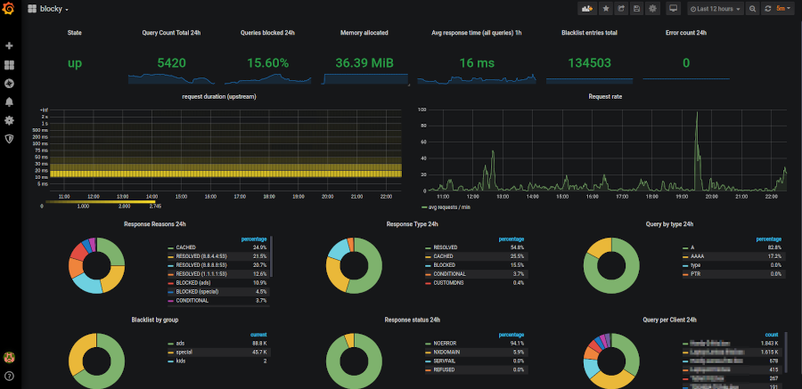
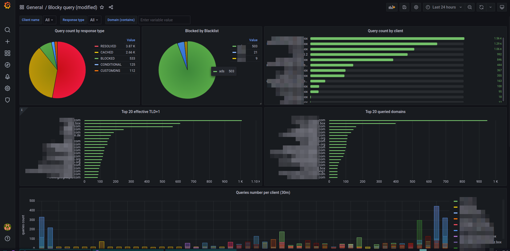

# Integration in Grafana

## Prometheus

### Prometheus export

Blocky can optionally export metrics for [Prometheus](https://prometheus.io/).

Following metrics will be exported:

| name                                             |   Description                                            |
| ------------------------------------------------ | -------------------------------------------------------- |
| blocky_build_info                                | Version number and build info                            |
| blocky_denylist_cache_entries                    | Gauge of entries in the denylist cache, partitioned by group |
| blocky_allowlist_cache_entries                   | Gauge of entries in the allowlist cache, partitioned by group |
| blocky_error_total                               | Counter of total queries that ended in error for any reason |
| blocky_query_total                               | Counter of total queries, partitioned by client and DNS request type (A, AAAA, PTR, etc) |
| blocky_request_duration_seconds                  | Histogram of request duration, partitioned by response type (Blocked, cached, etc)  |
| blocky_response_total                            | Counter of responses, partitioned by response type (Blocked, cached, etc), DNS response code, and reason |
| blocky_blocking_enabled                          | Boolean 1 if blocking is enabled, 0 otherwise |
| blocky_cache_entries                             | Gauge of entries in cache |
| blocky_cache_hits_total                          | Counter of the number of cache hits |
| blocky_cache_misses_total                        | Counter of the number of Cache misses |
| blocky_last_list_group_refresh_timestamp_seconds | Timestamp of last list refresh |
| blocky_prefetches_total                          | Counter of prefetched DNS responses |
| blocky_prefetch_hits_total                       | Counter of requests that hit the prefetch cache |
| blocky_prefetch_domain_name_cache_entries        | Gauge of domain names being prefetched |
| blocky_failed_downloads_total                    | Counter of failed list downloads |
| blocky_dnssec_validation_total                   | Counter of DNSSEC validations, partitioned by result (secure, insecure, bogus, indeterminate) |
| blocky_dnssec_cache_hits_total                   | Counter of DNSSEC validation cache hits |
| blocky_dnssec_validation_duration_seconds        | Histogram of DNSSEC validation duration, partitioned by result |
| blocky_redis_cache_buffer_drops_total            | Counter of cache writes dropped because the Redis write-through buffer is full — non-zero values indicate Redis cannot keep up with cache writes |
| blocky_rate_limit_drops_total                    | Counter of queries dropped by the rate limiter, partitioned by protocol |
| blocky_rate_limit_cap_exhausted_total            | Counter of queries dropped because the rate limiter bucket store was full |
| blocky_rate_limit_active_buckets                 | Gauge of token buckets (≈ distinct clients) currently tracked by the rate limiter |
| blocky_dnstap_frames_dropped_total               | Counter of dnstap frames dropped because the internal buffer is full - non-zero values indicate the collector is slow or unreachable |

!!! note "`reason` label for blocked responses"

    To keep the `reason` label of `blocky_response_total` bounded, blocked responses use the matched
    group names only (e.g. `BLOCKED (ads)`), **not** the matched rule. The full reason including the
    matched rule (e.g. `BLOCKED (ads: *.docler.com)`) is still available in the [query log](configuration.md#query-log).
    This avoids unbounded metric cardinality when large deny lists are used.

### Grafana dashboard

Example [Grafana](https://grafana.com/) dashboard
definition [as JSON](blocky-grafana.json)
or [at grafana.com](https://grafana.com/grafana/dashboards/13768)
.

The dashboard is organized in sections (overview, traffic, latency, blocking & lists, cache & prefetching, DNSSEC,
rate limiting, Go runtime) and uses only Grafana core panels, so no additional plugins are needed. The "Blocking
control" buttons in the overview section enable or temporarily disable blocking via the blocky API.

When importing the dashboard, set the "blocky API URL" input to the address under which your browser can reach the
blocky HTTP API (e.g. `https://blocky.example.com` or `http://192.168.1.2:4000`) — it is used by the blocking
control buttons.

### Requirements

- Grafana 10.2 or newer: the blocking control buttons use canvas button elements with API calls. All other panels
  also work with older Grafana versions.
- blocky newer than v0.31 if Grafana is served from a different origin than the blocky API: older blocky versions
  reject the CORS preflight which Grafana sends for the blocking control buttons. Alternatively, expose the blocky
  API on the same origin as Grafana through your reverse proxy.

### Grafana and Prometheus example project

This [repo](https://github.com/0xERR0R/blocky-grafana-prometheus-example) contains example docker-compose.yml with
blocky, prometheus (with configured scraper for blocky) and grafana with prometheus datasource.

## MySQL / MariaDB

If database query logging is activated (see [Query logging](configuration.md#query-logging)), you can use following
Grafana Dashboard [as JSON](blocky-query-grafana.json)
or [at grafana.com](https://grafana.com/grafana/dashboards/14980)

.

Please define the MySQL source in Grafana, which points to the database with blocky's log entries.

## Postgres

The JSON for a Grafana dashboard equivalent to the MySQL/MariaDB version is located [here](blocky-query-grafana-postgres.json)

--8<-- "docs/includes/abbreviations.md"
