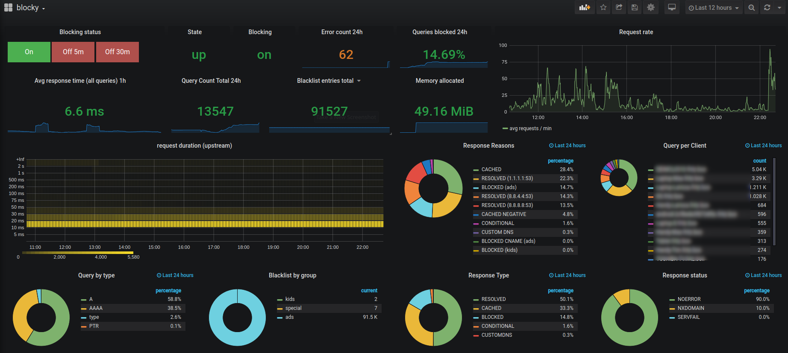

# Integration in Grafana

## Prometheus

### Prometheus export

Blocky can optionally export metrics for [Prometheus](https://prometheus.io/).

Following metrics will be exported:

| name                                             |   Description                                            |
| ------------------------------------------------ | -------------------------------------------------------- |
| blocky_blacklist_cache / blocky_whitelist_cache  | Number of entries in blacklist/whitelist cache, partitioned by group |
| blocky_error_total                | Counter for internal errors |
| blocky_query_total                | Number of total queries, partitioned by client and DNS request type (A, AAAA, PTR, etc) |
| blocky_request_duration_ms_bucket | Request duration histogram, partitioned by response type (Blocked, cached, etc)  |
| blocky_response_total             | Number of responses, partitioned by response type (Blocked, cached, etc), DNS response code, and reason |
| blocky_blocking_enabled           | 1 if blocking is enabled, 0 otherwise |
| blocky_cache_entry_count          | Number of entries in cache |
| blocky_cache_hit_count / blocky_cache_miss_count | Cache hit/miss counters |
| blocky_prefetch_count | Amount of prefetched DNS responses |
| blocky_prefetch_domain_name_cache_count | Amount of domain names being prefetched |
| blocky_failed_download_count      | Number of failed list downloads |

### Grafana dashboard

Example [Grafana](https://grafana.com/) dashboard
definition [as JSON](https://github.com/0xERR0R/blocky/blob/master/docs/blocky-grafana.json)
or [at grafana.com](https://grafana.com/grafana/dashboards/13768)
.

This dashboard shows all relevant statistics and allows enabling and disabling the blocking status.

### Grafana configuration

Please install `grafana-piechart-panel` and
set [disable-sanitize-html](https://grafana.com/docs/grafana/latest/installation/configuration/#disable-sanitize-html)
in config or as env to use control buttons to enable/disable the blocking status.

### Grafana and Prometheus example project

This [repo](https://github.com/0xERR0R/blocky-grafana-prometheus-example) contains example docker-compose.yml with
blocky, prometheus (with configured scraper for blocky) and grafana with prometheus datasource.

## MySQL / MariaDB

If database query logging is activated (see [Query logging](configuration.md#query-logging)), you can use following
Grafana Dashboard [as JSON](https://github.com/0xERR0R/blocky/blob/master/docs/blocky-query-grafana.json)
or [at grafana.com](https://grafana.com/grafana/dashboards/14980)

.

Please define the MySQL source in Grafana, which points to the database with blocky's log entries.

--8<-- "docs/includes/abbreviations.md"
